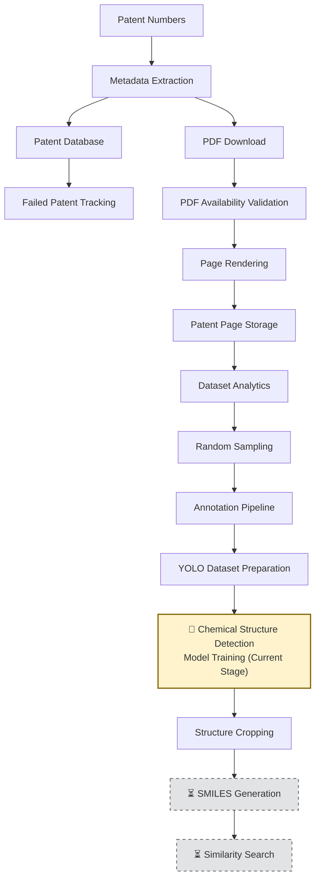
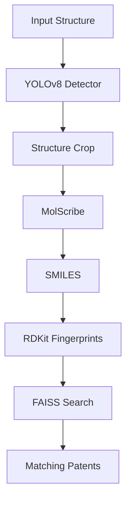

<div align="center">

# 🧪 PatentStructAI

### Computer Vision and Cheminformatics Platform for Patent Structure Search

**Detect. Localize. Recognize. Search chemical structures across patent collections.**

[](https://www.python.org/)
[](https://fastapi.tiangolo.com/)
[](https://pytorch.org/)
[](https://www.rdkit.org/)
[](https://www.mysql.com/)
[]()

[Overview](#-overview) • [Pipeline](#-pipeline) • [Features](#-features) • [Dataset](#-current-dataset) • [Tech Stack](#-technology-stack) • [Getting Started](#-getting-started) • [Roadmap](#-roadmap)

</div>

---

## 📖 Overview

**PatentStructAI** is a scalable cheminformatics and patent-mining platform that automates chemical structure search across large patent collections.

Chemical patent analysis has traditionally been a manual, painstaking process — patent analysts and researchers searching through thousands of documents to find a single matching compound. It's **slow**, **error-prone** and **doesn't scale**.

PatentStructAI replaces that workflow with computer vision, deep learning, and cheminformatics — turning a multi-day manual search into an automated, scalable pipeline.

Given an input chemical structure image, the system:

| Step | Action |
|:---:|---|
| 1️⃣ | Searches through thousands of patent documents |
| 2️⃣ | Detects chemical structures embedded in patent pages |
| 3️⃣ | Converts detected structures into machine-readable molecular representations (SMILES) |
| 4️⃣ | Compares structures using cheminformatics fingerprinting |
| 5️⃣ | Returns matching patents with similarity scores and metadata |

> **Scope note:** This repository currently focuses on building the chemical structure detection component of a larger patent-search platform. OCSR, fingerprint generation, and similarity search modules are under active development.

---

## 🎯 Why PatentStructAI?

Chemical patents contain millions of embedded molecular structures that are difficult to search using traditional text-based patent search systems.

PatentStructAI aims to bridge this gap by combining computer vision, Optical Chemical Structure Recognition (OCSR), and molecular similarity search into a unified workflow capable of identifying structurally related compounds directly from patent documents.

---

## ⚙️ Pipeline



---

## ✨ Features

### 📥 Patent Ingestion
- Bulk patent metadata ingestion
- Google Patents integration
- Patent PDF retrieval
- MySQL-backed storage

### 🛠️ Patent Processing
- PDF page rendering
- Patent page indexing
- Large-scale document processing pipeline

### 📊 Dataset Analytics
- Patent statistics generation
- Country-wise patent distribution
- Failed patent tracking
- PDF availability monitoring

### 🏷️ Annotation Pipeline
- Random page sampling
- Annotation dataset creation
- Chemical region detection dataset preparation

### 🎯 YOLO Dataset Preparation
- CVAT-based annotation workflow
- YOLO format label generation
- Automated image–label synchronization
- Chemical structure bounding box annotations
- Current dataset: **42 manually annotated patent pages** containing **274 chemical structure annotations**

### 🔬 Current Detection Task

The current object detection model is trained to identify:

- Single chemical structures
- Markush structures
- Reaction schemes
- Multi-compound grids

**Output:** Bounding boxes localizing chemistry-related regions on patent pages.

### 🧬 Chemical Structure Extraction *(Planned)*
- Structure cropping pipeline — ⏳ *planned*
- Structure image extraction — ⏳ *planned*
- Crop quality validation — ⏳ *planned*

### 🔬 Molecular Recognition *(Planned)*
- Optical Chemical Structure Recognition (OCSR)
- SMILES generation
- Molecular graph reconstruction

### 🔍 Similarity Search *(Planned)*
- RDKit fingerprints
- Molecular similarity scoring
- FAISS vector search

### 🌐 API *(Planned)*
- Structure image upload endpoint
- Patent search endpoint
- Similarity ranking API

---

## 📂 Project Structure

```
PATENTSTRUCTAI/
├── annotations/      # CVAT annotation datasets
├── api/               # Future FastAPI endpoints
├── chemistry/           # RDKit fingerprinting & similarity
├── database/              # SQLAlchemy models & MySQL integration
├── extraction/               # YOLO detection & structure extraction
├── ingestion/                  # Patent acquisition pipeline
├── search/                       # FAISS indexing and retrieval
├── data/
│   ├── patents/                    # Raw patent metadata & PDFs
│   ├── pages/                        # Rendered patent page images
│   └── labels/                         # YOLO-format annotation labels
└── requirements.txt
```

---

## 📊 Current Dataset

### Patent Corpus

<div align="center">

| Metric | Count |
|---|---:|
| ✅ Successfully processed patents | **37** |
| 📄 Rendered patent pages | **1,654** |
| 🌍 Countries represented | **8** (US, WO, JP, CN, KR, EP, TW, AU) |

</div>

### Dataset Composition

| Category | Pages |
|---|---:|
| Markush Structures | 12 |
| Reaction Schemes | 10 |
| Multiple Compound Pages | 6 |
| Single Compound Pages | 2 |
| Mixed Structure Pages | Remaining |
> Category counts represent the manually reviewed chemistry-page subset used during dataset construction.

### Annotation Dataset

- 📦 YOLO-format object detection dataset
- 🏷️ **42** manually annotated patent pages
- 🧬 **274** chemical structure annotations
- 📐 Chemical structure bounding box annotations, including:
  - Markush structures
  - Single compounds
  - Multiple compounds / compound grids
  - Reaction schemes

### Annotation Statistics

| Metric | Value |
|---|---:|
| Annotated Pages | **42** |
| Total Structures | **274** |
| Average Structures / Page | **6.52** |
| Empty Pages | **0** |
| Most Crowded Page | **28 structures** |

---

## 🧪 Experimental Progress

**Current dataset:**
- 37 patents processed
- 1,654 rendered patent pages
- 42 annotated chemistry pages
- 274 structure annotations

**Current stage:**
- Building a custom YOLOv8 detector for chemical structure localization
- Dataset expansion and annotation are ongoing
- Model evaluation results will be added after training completes

---

## 📈 Model Performance

> Training is in progress. This section will be populated with evaluation metrics once the YOLOv8 detector finishes training.

| Metric | Value |
|---|---:|
| mAP50 | *pending* |
| Precision | *pending* |
| Recall | *pending* |

---

## 🚦 Project Status

<table>
<tr><td width="33%" valign="top">

### ✅ Completed
- Patent ingestion pipeline
- Patent metadata validation
- PDF download automation
- Patent page rendering
- Patent database storage
- Dataset analytics
- Chemistry page sampling pipeline
- CVAT annotation workflow
- YOLO dataset generation

</td><td width="33%" valign="top">

### 🔄 In Progress
- Custom YOLOv8 chemical structure detector

</td><td width="33%" valign="top">

### ⏳ Upcoming
- Structure cropping pipeline
- MolScribe integration
- Molecular fingerprint generation
- Similarity search engine

</td></tr>
</table>

---

## 🧰 Technology Stack

<div align="center">

| Layer | Technologies |
|---|---|
| **Backend** | Python · FastAPI · SQLAlchemy · MySQL |
| **Machine Learning** | PyTorch · TorchVision · Ultralytics YOLOv8 · OpenCV |
| **Cheminformatics** | RDKit |
| **Document Processing** | PyMuPDF · BeautifulSoup · Requests |
| **Similarity Search** | FAISS |

</div>

---

## 🎯 Scalability Goals

- 🚀 Process **thousands** of patents
- 🔍 Detect structures from full patent pages
- 🧮 Perform large-scale molecular similarity search
- ⚡ Support real-time structure lookup

---

## 🚀 Getting Started

### Clone the repository

```bash
git clone https://github.com/mehak-chopra/PatentStructAI.git
cd PatentStructAI
```

### Create a virtual environment

```bash
python -m venv venv
source venv/bin/activate   # On Windows: venv\Scripts\activate
```

### Install dependencies

```bash
pip install -r requirements.txt
```

---

## 🗺️ Roadmap

- [ ] Complete training & evaluation of the custom YOLOv8 chemical structure detector
- [ ] MolScribe integration for Optical Chemical Structure Recognition
- [ ] Molecular fingerprint indexing
- [ ] Patent similarity ranking engine
- [ ] FastAPI web application
- [ ] Interactive search dashboard

---

## 🏗️ Target Architecture



---

## 👩‍🔬 Author

**Mehak Chopra**
B.Tech Computer Science Engineering (Data Science)

**Research Interests:**
Computer Vision • Cheminformatics • Information Retrieval • Applied Machine Learning

---

<div align="center">

⭐ *If you find this project interesting, consider starring the repository!* ⭐

</div>
